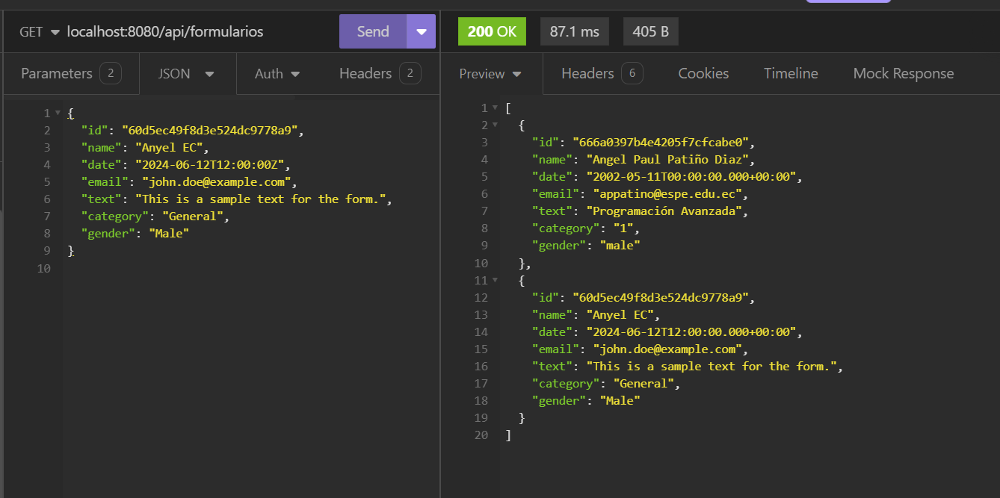
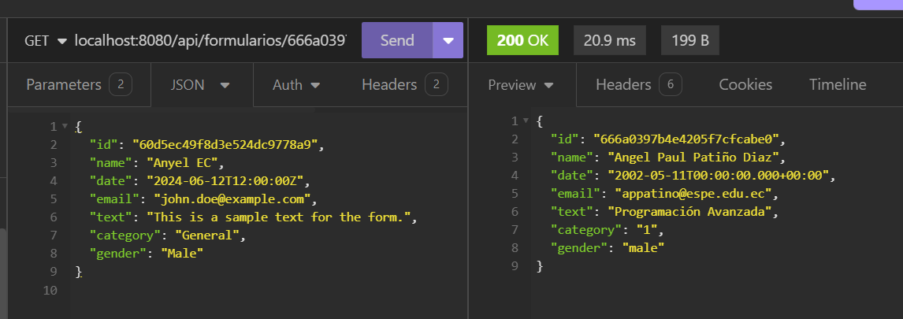

# **Select Language:** 🌍 
- [Español (Spanish)](README-es.md)
- [English](README.md)


# SaveFormAngular-MongoDB

SaveFormAngular-MongoDB es una aplicación backend desarrollada con Spring Boot y MongoDB. Permite crear, leer y eliminar formularios a través de una API REST.

## RESULTS
### Create Form

### Get All Forms

### Get Form by ID

### MongoDB


## Tabla de contenidos

- [Instalación](#instalación)
- [Configuración](#configuración)
- [Uso](#uso)
- [Estructura del proyecto](#estructura-del-proyecto)
- [Dependencias](#dependencias)
- [Autor](#autor)

## Instalación

1. Clona este repositorio:
   ```bash
   git clone https://github.com/Anyel-ec/Spring-Boot-MongoDB-SaveForm
   cd Spring-Boot-MongoDB-SaveForm
   ```

2. Asegúrate de tener [Java 17](https://www.oracle.com/java/technologies/javase/jdk17-archive-downloads.html) y [Maven](https://maven.apache.org/install.html) instalados en tu sistema.

3. Instala las dependencias del proyecto:
   ```bash
   mvn clean install
   ```

## Configuración

1. Crea un archivo `.env` en la raíz del proyecto con el siguiente contenido, ajustando la URL de MongoDB si es necesario:
   ```plaintext
   SPRING_DATA_MONGODB_URI=mongodb://localhost:27017/angular-form
   ```

2. Asegúrate de tener una instancia de MongoDB corriendo en `mongodb://localhost:27017`.

## Uso

1. Ejecuta la aplicación:
   ```bash
   mvn spring-boot:run
   ```

2. La API estará disponible en `http://localhost:8080`.

### Endpoints de la API

- **Crear un formulario**
  ```http
  POST /api/formularios
  ```

- **Obtener todos los formularios**
  ```http
  GET /api/formularios
  ```

- **Obtener un formulario por ID**
  ```http
  GET /api/formularios/{id}
  ```

- **Eliminar un formulario por ID**
  ```http
  DELETE /api/formularios/{id}
  ```

## Estructura del proyecto

- `config/`: Configuración de CORS.
- `controller/`: Controladores REST para manejar las solicitudes HTTP.
- `model/`: Definición del modelo `Formulario`.
- `repository/`: Interfaz del repositorio MongoDB.
- `service/`: Servicios que contienen la lógica de negocio.
- `resources/`: Archivos de configuración de Spring Boot.

## Dependencias

- **Spring Boot Starter Data MongoDB**: Proporciona integración con MongoDB.
- **Spring Boot Starter Web**: Configuración básica para aplicaciones web.
- **Spring Boot Starter Validation**: Proporciona soporte para validación de datos.
- **Dotenv Java**: Permite el uso de archivos `.env` para la configuración.
- **Lombok**: Simplifica el código Java mediante anotaciones.
- **Spring Boot DevTools**: Herramientas para desarrollo, como reinicio automático.
- **Spring Boot Starter Test**: Dependencias para pruebas unitarias.

Para más detalles, consulta el archivo `pom.xml`.

## Autor

Este proyecto fue desarrollado por [tu nombre].

---

Si tienes alguna pregunta o sugerencia, no dudes en abrir un issue o contactarme. ¡Gracias por usar SaveFormAngular-MongoDB!