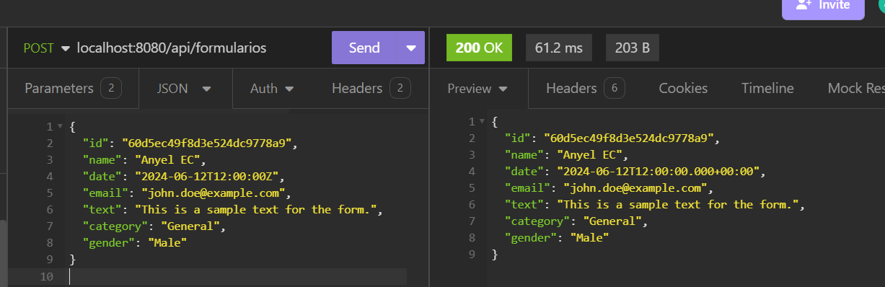

# **Select Language:** 🌍
- [Español (Spanish)](README-es.md)
- [English](README.md)


# SaveFormAngular-MongoDB

SaveFormAngular-MongoDB is a backend application developed with Spring Boot and MongoDB. It allows creating, reading, and deleting forms via a REST API.

## RESULTS
### Create Form

### Get All Forms

### Get Form by ID

### MongoDB


## Table of Contents

- [Installation](#installation)
- [Configuration](#configuration)
- [Usage](#usage)
- [Project Structure](#project-structure)
- [Dependencies](#dependencies)
- [Author](#author)

## Installation

1. Clone this repository:
   ```bash
   git clone https://github.com/Anyel-ec/Spring-Boot-MongoDB-SaveForm
   cd Spring-Boot-MongoDB-SaveForm
   ```

2. Ensure you have [Java 17](https://www.oracle.com/java/technologies/javase/jdk17-archive-downloads.html) and [Maven](https://maven.apache.org/install.html) installed on your system.

3. Install the project dependencies:
   ```bash
   mvn clean install
   ```

## Configuration

1. Create a `.env` file at the root of the project with the following content, adjusting the MongoDB URL if necessary:
   ```plaintext
   SPRING_DATA_MONGODB_URI=mongodb://localhost:27017/angular-form
   ```

2. Ensure you have a MongoDB instance running at `mongodb://localhost:27017`.

## Usage

1. Run the application:
   ```bash
   mvn spring-boot:run
   ```

2. The API will be available at `http://localhost:8080`.

### API Endpoints

- **Create a form**
  ```http
  POST /api/formularios
  ```

- **Get all forms**
  ```http
  GET /api/formularios
  ```

- **Get a form by ID**
  ```http
  GET /api/formularios/{id}
  ```

- **Delete a form by ID**
  ```http
  DELETE /api/formularios/{id}
  ```

## Project Structure

- `config/`: CORS configuration.
- `controller/`: REST controllers to handle HTTP requests.
- `model/`: Definition of the `Formulario` model.
- `repository/`: MongoDB repository interface.
- `service/`: Services containing business logic.
- `resources/`: Spring Boot configuration files.

## Dependencies

- **Spring Boot Starter Data MongoDB**: Provides integration with MongoDB.
- **Spring Boot Starter Web**: Basic configuration for web applications.
- **Spring Boot Starter Validation**: Provides support for data validation.
- **Dotenv Java**: Allows using `.env` files for configuration.
- **Lombok**: Simplifies Java code with annotations.
- **Spring Boot DevTools**: Development tools like auto-restart.
- **Spring Boot Starter Test**: Dependencies for unit testing.

For more details, see the `pom.xml` file.

## Author

This project was developed by [your name].

---

If you have any questions or suggestions, feel free to open an issue or contact me. Thank you for using SaveFormAngular-MongoDB!